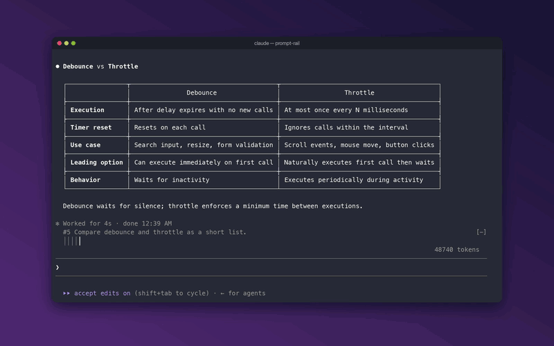
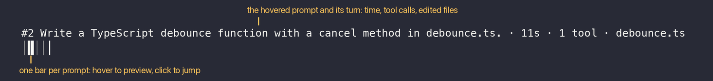
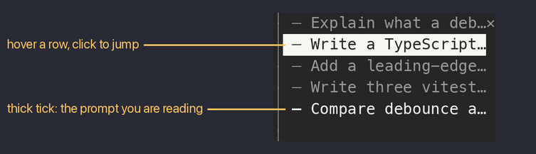
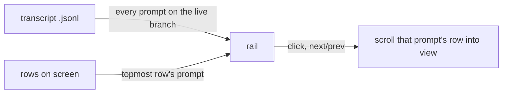

<div align="center">

# prompt-rail

A rail of your prompts for Claude Code. Hover to read one, click to jump back to it.




</div>

## Quick start

1. Turn on function hooks (early access, Claude Code 2.1.280+) in `~/.claude/settings.json`:

   ```json
   { "env": { "CLAUDE_CODE_ENABLE_FUNCTION_HOOKS": "1" } }
   ```

2. Install, from your shell or inside a session:

   ```bash
   claude plugin marketplace add oikon48/prompt-rail
   claude plugin install prompt-rail@oikon48
   ```

   ```
   /plugin marketplace add oikon48/prompt-rail
   /plugin install prompt-rail@oikon48
   ```

3. Start a new session. The rail opens on its own.

Mouse works best with `"tui": "fullscreen"`.

## Two layouts

### Horizontal, above the prompt (default)



### Vertical, beside the transcript



## Commands

| Command | |
| --- | --- |
| `/prompt-rail horizontal` | Bars above the prompt input |
| `/prompt-rail vertical` | A pane beside the transcript |
| `/prompt-rail off` | Hide the rail |
| `/prompt-rail next` | Jump to the next prompt |
| `/prompt-rail prev` | Jump to the previous prompt |
| `/prompt-rail` | Reopen the rail in the current layout |

The layout is also the "Rail mode" row in `/config`, and it is kept across sessions.

## Tick legend

| Tick | Meaning |
| --- | --- |
| `━` `┃` | The prompt you are reading |
| `─` `│` | Any other prompt |
| `┄` `┆` | A prompt Claude Code refused to scroll to; `next` and `prev` skip it |

## How it works

<details>
<summary>From the transcript file to the rail</summary>



The rail lists the prompts of the live branch, so prompts abandoned with `/rewind` drop out, and prompts from before a resume are listed too. The prompt you are reading owns the topmost row on screen. The transcript is read again only when its size or time changed.

</details>

## Limitations

<details>
<summary>Known limits</summary>

- Function hooks are early access, and their API may change between Claude Code releases.
- The hover card with the turn summary is part of the horizontal rail; the terminal alone draws it.
- The Claude desktop app shows no rail. Checked with its bundled Claude Code 2.1.280, the engine reports the pane as placed, but the app never asks the plugin to draw it.
- The dock width is shared by all plugin panes; drag its edge to narrow it, down to 24 columns.
- A `/compact` command's own row cannot be jumped to; its tick turns dotted after the first try.
- Near the end of the transcript, `next` cannot scroll further.

</details>

## Development

```bash
claude --plugin-dir plugins/prompt-rail        # load this checkout; saving reloads it
claude plugin validate plugins/prompt-rail
claude plugin test plugins/prompt-rail
```

Run `/plugin-types .claude/types` in a session here for type declarations. Bump the version in `plugins/prompt-rail/.claude-plugin/plugin.json` with each release, since installed copies update only when it changes.

## License

[MIT](LICENSE)
